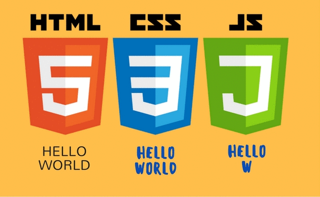

# Aprendizado de Programação na DIO
Repositório para salvar códigos de Javascript aprendidos na Plataforma DIO. 

## Conteúdos do repositório:

1. Lógica de Programação
2. Introdução ao HTML e CSS3
3. Construindo Páginas com Bootstrap
4. Introdução ao JavaScript
5. Sintaxe Básica em JavaScript
6. Sintaxe e Operadores (Utilizando JS)
7. Variáveis e Tipos (JS)

## Ferramentas Utilizadas

- HTML5
- CSS3
- Javascript
- Bootstrap
